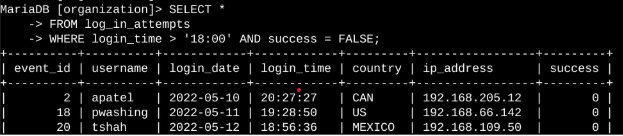
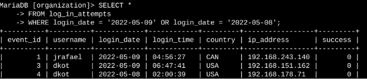
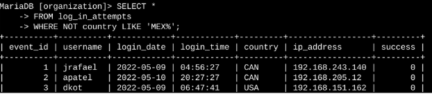
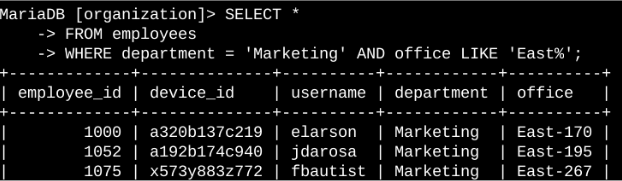
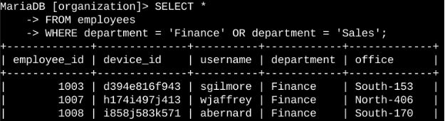
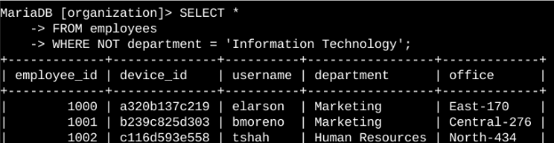

# Apply filters to SQL queries
## Project description
As part of an internal security initiative, I was responsible for strengthening system defenses, investigating suspicious activity, and coordinating updates across devices. This involved writing SQL queries to extract relevant data from our system logs and employee records. Below are examples of how I used SQL filters to support these efforts.
##Retrieve after hours failed login attempts
A potential breach was flagged outside of normal business hours.I needed to identify all failed login attempts that occurred during that time window.

The query pulls entries from the log_in_attempts table where the login time is after 18:00 and the attempt was unsuccessful. I used a WHERE clause with AND to combine both conditions:

This query is used to identify failed login attempts that occurred after 6:00 PM (18:00). To build it, I started by selecting all records from the log_in_attempts table. I then applied a WHERE clause with two conditions using the AND operator: one to filter for login times after '18:00', and another to return only entries where the login was unsuccessful (success = FALSE).
## Retrieve login attempts on specific dates
A suspicious event occurred on 2022-05-09. I needed to investigate entries on the day of and the day before.

The following code demonstrates how I created a SQL query to filter for login attempts that occurred on specific dates.

The first part of the screenshot is my query, and the second part is a portion of the output. This query returns all login attempts that occurred on 2022-05-09 or 2022-05-08. First, I started by selecting all data from the log_in_attempts table. Then, I used a WHERE clause with an OR operator to filter my results to output only login attempts that occurred on either 2022-05-09 or 2022-05-08. The first condition is login_date = '2022-05-09', which filters for logins on 2022-05-09. The second condition is login_date = '2022-05-08', which filters for logins on 2022-05-08.
## Retrieve login attempts outside of Mexico
Detect login attempts originating from outside the expected geographic region, which could indicate unauthorized access attempts.

The following code demonstrates how I created a SQL query to filter for login attempts that occurred outside of Mexico. 

I used the NOT operator with LIKE 'MEX%' to exclude any login attempts from Mexico. The LIKE clause matches both "MEX" and "MEXICO", allowing flexibility in how the country is recorded.
This query helps identify anomalies in login location data, supporting the organization's security monitoring process.
## Retrieve employees in Marketing
Support IT operations by identifying specific machines used by Marketing employees in the East building for an upcoming hardware upgrade.

The following code demonstrates how I created a SQL query to filter for employee machines from employees in the Marketing department in the East building.

* I filtered the employees table using:   

  * department = 'Marketing' to target the relevant team.   
  
  * office LIKE 'East%' to match all East building offices, regardless of room number.   
  
The LIKE operator with a wildcard (%) accounts for varied office labels, such as “East-101” or “East Wing”.
## Retrieve employees in Finance or Sales
Prepare for a different security update that only applies to employees in the Finance and Sales departments.

The following code demonstrates how I created a SQL query to filter for employee machines from employees in the Finance or Sales departments.

I used the OR operator in the WHERE clause to include:  

* department = 'Finance'  

* department = 'Sales'  

This ensures both groups are included in the update process, even though they belong to separate departments.
## Retrieve all employees not in IT
Target non-IT employees for a broader security patch, excluding users with administrative access or system-level roles.

The following demonstrates how I created a SQL query to filter for employee machines from employees not in the  Information Technology department.

The first part of the screenshot is my query, and the second part is a portion of the output. The query returns all employees not in the Information Technology department. First, I started by selecting all data from the employees table. Then, I used a WHERE clause with NOT to filter for employees not in this department.
## Summary
I applied filters to SQL queries to get specific information on login attempts and employee machines. I used two different tables, log_in_attempts and employees. I used the AND, OR, and NOT operators to filter for the specific information needed for each task. I also used LIKE and the percentage sign (%) wildcard to filter for patterns.
